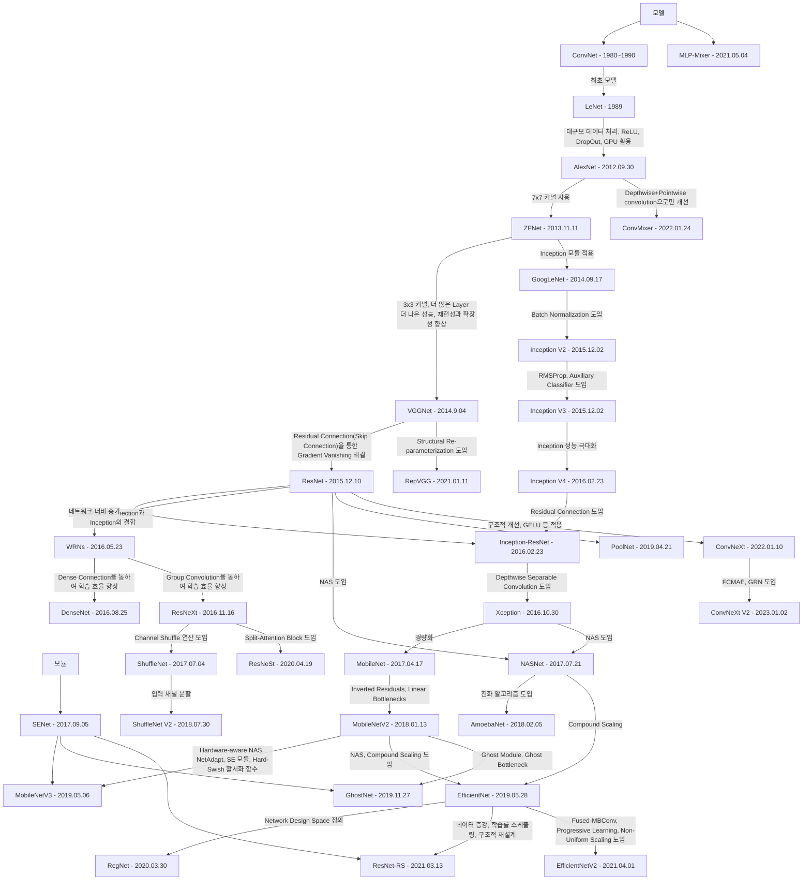

## Image Recognition
  Image Recognition 기반 발전 모델에 대해 설명합니다.  

  1. AlexNet - 2012.09.30
  2. ZFNet - 2013.11.12
  3. VGGNet - 2014.09.04
  4. GoogLeNet (InceptionV1) - 2014.09.17
  5. Highway Networks - 2015.07.22
  6. InceptionV2 - 2015.02.11
  7. InceptionV3 - 2015.12.02
  8. ResNet - 2015.12.10
  9.  InceptionV4 - 2016.02.23
  10. Inception-ResNet - 2016.02.23
  11. Wide ResNet - 2016.05.23
  12. DenseNet - 2016.08.25
  13. Xception - 2016.10.07
  14. ResNeXt - 2016.11.16
  15. MobileNet - 2017.04.17
  16. ShuffleNet - 2017.07.04
  17. NASNet - 2017.07.21
  18. SENet - 2017.09.05
  19. MobileNet V2 - 2018.01.13
  20. AmoebaNet - 2018.02.05
  21. ShuffleNetV2 - 2018.07.30
  22. PoolNet - 2019.04.21
  23. MobileNet V3 - 2019.05.06
  24. EfficientNet - 2019.05.28
  25. GhostNet - 2019.11.27
  26. RegNet - 2020.03.30
  27. ResNeSt - 2020.04.19
  28. RepVGG - 2021.01.11
  29. EfficientNetV2 - 2021.04.01
  30. MLP-Mixer - 2021.05.04
  31. ResNet-Rs - 2021.10.01
  32. ConvNeXt - 2022.01.10
  33. ConvMixer - 2022.01.24
  34. ConvNeXtV2 - 2023.01.02

### ConvNet
  - 출시: 1980년대 후반 ~ 1990년대 초  
  - 성과  
    + LeNet  
    + CNN 설계 원칙 제공  
  - 기존 문제와 해결 방법  
    + Fully Connected Network의 이미지 처리의 부적합함  
      해결: Convolution을 통해 패치로 분할, 필터로 패턴 학습  
    + 입력 데이터의 구조적 관계 학습 못함  
      해결: Pooling을 통해 입력 크기 줄임, 동일한 필터를 여러 위치에 적용하여 가중치 공유 함  
  - 한계점  
    + 전역적인 정보 학습 문제  
    + Gradient Vanishing problem  

## LeNet (CNN) 
  - 출시: 1989년  
  - 논문: LeCun backpropagation applied to handwritten zip code recognition  
  - 성과  
    + MNIST 데이터셋에서 우수한 성능  
    + 상용화  
  - 기존 문제와 해결 방법  
    + 비선형성을 학습에 문제가 있음  
      해결: 활성화 함수 도입  
  - 한계점   
    + 간단한 작업에만 적합  
    + 고정된 필터 크기  
    + 전역적인 정보 학습 문제  
    + Gradient Vanishing problem   

## AlexNet
  - 출시: 2012년 9월 30일  
  - 논문: ImageNet Classification with Deep Convolutional Neural Networks  
  - 성과  
    + ImageNet ILSVRC 2012 우승  
    + GPU 가속 사용  
  - 기존 문제와 해결 방법  
    + Gradient Vanishing Problem 및 비효율적인 비선형 활성화 함수  
      해결: ReLU 활성화 함수 도입으로 문제 완화  
      새로운 문제: ReLU는 네트워크가 30층 이상으로 깊어지면 다시 Gradient Vanishing Problem 발생  
    + Overfitting 문제, 대규모 네트워크는 학습 데이터를 과도하게 학습하면 성능이 저하되는 경향이 있음.  
      해결: Dropout 기법 도입, Data Augmentation (데이터 회전, 크기 조정, 잘라내기 등 데이터 증강 기법)  
    + 대규모 데이터의 연산 비용 문제  
      해결: GPU 가속 활용  
  - 한계점   
    + 고정된 필터 크기  
    + 전역적인 정보 학습 문제  
    + 대규모 네트워크로 높은 메모리 사용량  
    + 네트워크를 단순히 깊게 쌓는 방식으로 효율성이 부족  
    + 네트워크를 30층 이상 깊게 만들면 다시 기울기 소실 문제 발생  

## ZFNet
  - 출시: 2013년 11월 12일  
  - 논문: Visualizing and Understanding Convolutional Networks  
  - 성과  
    + ILSVRC 2013 우승  
  - 기존 문제와 해결 방법  
    + 필터 크기의 비효율성  
      해결: 기존 11x11 에서 7x7로 필터 크기 줄임  
    + CNN의 불투명성  
      해결: DeconvNet을 도입하여 학습한 CNN의 특징을 시각화 함, 그러나 완벽한 해결 방법은 아님  
  - 한계점   
    + 고정된 필터 크기  
    + 전역적인 정보 학습 문제  
    + 대규모 네트워크로 높은 메모리 사용량  
    + 네트워크를 단순히 깊게 쌓는 방식으로 효율성이 부족  
    + 네트워크를 30층 이상 깊게 만들면 다시 기울기 소실 문제 발생  

## VGGNet
  - 출시: 2014년 9월 4일  
  - 논문: Very Deep Convolutional Networks for Large-Scale Image Recognition  
  - 성과  
    + ILSVRC 2014 준우승  
    + 기초 모델의 기준점 제시: VGG11, VGG13, VGG16, VGG19, Tiny VGG  
  - 기존 문제와 해결 방법  
    + 필터 크기의 비효율성  
      해결: 기존 7x7 에서 3x3로 필터 크기 줄임  
    + 네트워크 깊이에 따른 연산 비용의 증가  
      해결: 모든 Convolution Layer에 작은 필터 3x3을 사용하여 복잡성을 줄임  
    + 기존 AlexNet과 ZFNet의 네트워크 구조는 비규칙적임  
      해결: 동일한 필터 크기, 동일한 패턴의 네트워크 블록 사용  
  - 한계점   
    + 고정된 필터 크기  
    + 전역적인 정보 학습 문제  
    + 대규모 네트워크로 높은 메모리 사용량  
    + 네트워크를 단순히 깊게 쌓는 방식으로 효율성이 부족  
    + 네트워크를 30층 이상 깊게 만들면 다시 기울기 소실 문제 발생  

## GoogLeNet
  - 출시: 2014년 9월 17일  
  - 논문: Going Deeper with Convolutions  
  - 성과  
    + ILSVRC 2014 우승  
  - 기존 문제와 해결 방법  
    + 네트워크 깊이에 따른 연산 비용의 증가  
      해결: 다양한 크기의 필터(1x1, 3x3, 5x5)를 병렬로 적용하여, 여러 스케일의 특징을 추출하는 Inception 모듈 도입하여 연산량 줄임   
  - 한계점   
    + 전역적인 정보 학습 문제  
    + 대규모 네트워크로 높은 메모리 사용량  
    + 네트워크를 단순히 깊게 쌓는 방식으로 효율성이 부족  
    + 네트워크를 30층 이상 깊게 만들면 다시 기울기 소실 문제 발생  

## Highway Networks
  - 출시: 2015년 7월 22일  
  - 논문: Training Very Deep Networks  
  - 성과  
    + 매우 깊은 신경망에서도 효과적으로 학습할 수 있다.
  - 기존 문제와 해결 방법  
    + 기울기 소실 문제  
      해결: 게이팅 메커니즘, 각 레이어에 게이트를 추가하여 정보의 흐름을 조절 함. 수백개의 레이어도 가능  
  - 한계점   
    + 고정된 필터 크기  
    + 전역적인 정보 학습 문제  
    + 대규모 네트워크로 높은 메모리 사용량  
    + 네트워크를 단순히 깊게 쌓는 방식으로 효율성이 부족  

## Inception V2
  - 출시: 2015년 2월 11일
  - 논문: Batch Normalization: Accelerating Deep Network Training by Reducing Internal Covariate Shift  
  - 성과
    + 42개의 레이어로 구성되었지만, 연산량은 GoogLeNet의 약 2.5배에 불과하며, VGGNet보다 훨씬 효율적  
  - 기존 문제와 해결 방법
    + 큰 필터는 연산 비용이 높고, 네트워크 깊이와 너비를 증가시키는 데 한계가 있음  
      해결: Factorizing Convolutions, 합성곱 분해를 통해 연산 효율성을 높였다. (5x5를 3x3 필터 두개로 대체하는 등)  
      Grid Size Reduction, Pooling 계층을 사용할 때, 스트라드가 2인 컨볼루션 계층과 풀링 계층을 병렬로 사용하여 특징 맵의 크기를 효율적으로 줄임  
  - 한계점   
    + 전역적인 정보 학습 문제  
    + 대규모 네트워크로 높은 메모리 사용량
    + 네트워크를 단순히 깊게 쌓는 방식으로 효율성이 부족
    + 네트워크를 30층 이상 깊게 만들면 다시 기울기 소실 문제 발생  
    + 다양한 기법이 결합되어 있어 구현이 복잡함  

## Inception V3
  - 출시: 2015년 12월 2일  
  - 논문: Rethinking the Inception Architecture for Computer Vision  
  - 성과
    + ImageNet 데이터셋에서 높은 정확도 달성  
  - 기존 문제와 해결 방법
    + 풀링 계층에서 정보 손실  
      해결: Grid Size Reduction 사용
    + 깊은 네트워크를 학습할 때 최적화 과정에서 기울기 소실 문제 발생  
      해결: RMSProp 옵티마이저 사용(학습 속도 개선), Auxiliary Classifier 추가(보조 분류기로 기울기 소실 완화)
  - 한계점   
    + 전역적인 정보 학습 문제  
    + 대규모 네트워크로 높은 메모리 사용량
    + 네트워크를 단순히 깊게 쌓는 방식으로 효율성이 부족
    + 네트워크를 30층 이상 깊게 만들면 다시 기울기 소실 문제 발생  
    + 다양한 기법이 결합되어 있어 구현이 복잡함  

## ResNet
  - 출시: 2015년 12월 10일  
  - 논문: Deep Residual Learning for Image Recognition  
  - 성과  
    + ImageNet 2015 우승, 3.57%의 오류율  
  - 기존 문제와 해결 방법  
    + 네트워크 깊이가 30층 이상으로 깊어질수록 Vanishing Gradient 문제 발생  
      해결
      - Residual Learning, 기존의 학습 목표를 직접 학습하는 대신, 입력과 출력의 차이인 잔체를 학습 함  
      - Skip Connection (Residual Connection), 입력을 다음 레이어로 직접 전달하는 연결을 추가하여 기울기 소실 문제 완화  
  - 한계점  
    + 전역적인 정보 학습 문제  
    + 대규모 네트워크로 높은 메모리 사용량  
    + 네트워크를 단순히 깊게 쌓는 방식으로 효율성이 부족  
    + (LeLU, Residual Learning이 필수가 됨)기울기 소실 문제가 완전히 해결되었다고 볼 수 있으나, 여전히 발생할 수 있다.  

## Inception V4
  - 출시: 2016년 2월 23일
  - 논문: Inception-v4, Inception-ResNet and the Impact of Residual Connections on Learning  
  - 성과
    + ImageNet 데이터셋에서 높은 정확도 달성  
  - 기존 문제와 해결 방법
    + 이전 Inception 버전들의 구조적 복잡성  
      해결: Inception 모듈 재설계  
  - 한계점   
    + 전역적인 정보 학습 문제  
    + 대규모 네트워크로 높은 메모리 사용량
    + 네트워크를 단순히 깊게 쌓는 방식으로 효율성이 부족
    + 네트워크를 30층 이상 깊게 만들면 다시 기울기 소실 문제 발생  

## Inception-ResNet
  - 출시: 2016년 2월 23일
  - 논문: Inception-v4, Inception-ResNet and the Impact of Residual Connections on Learning  
  - 성과
    + ImageNet 데이터셋에서 높은 정확도 달성  
  - 기존 문제와 해결 방법
    + 기존 Inception 계열은 네트워크 깊이가 깊어질수록 학습이 어려워지고 기울기 소실 발생  
      해결: Residual Connection 도입
  - 한계점   
    + 전역적인 정보 학습 문제  
    + 대규모 네트워크로 높은 메모리 사용량  
    + 네트워크를 단순히 깊게 쌓는 방식으로 효율성이 부족  
    + (LeLU, Residual Learning이 필수가 됨)기울기 소실 문제가 완전히 해결되었다고 볼 수 있으나, 여전히 발생할 수 있다.  
    + 다양한 기법이 결합되어 있어 구현이 복잡함  

## WRNs (Wide Residual Networks)
  - 출시: 2016년 5월 23일  
  - 논문: Wide Residual Networks  
  - 성과  
    + 깊이를 줄이고 너비를 늘려 학습 속도를 높이고 성능을 개선 함  
    + CIFAR-10, CIFAR-100, SVHN, COCO 등 다양한 데이터셋에서 기존 모델들을 능가하는 성능을 보임  
  - 기존 문제와 해결 방법  
    + 네트워크 깊이를 증가시키면 성능이 향상되었지만, 학습 시간이 길어지고 효율성이 떨어짐  
      해결: 네트워크 너비를 증가시킴, 해당 문제를 회피한 느낌  
  - 한계점  
    + 전역적인 정보 학습 문제  
    + 대규모 네트워크로 높은 메모리 사용량  
    + 네트워크를 단순히 깊게 쌓는 방식으로 효율성이 부족  
    + (LeLU, Residual Learning이 필수가 됨)기울기 소실 문제가 완전히 해결되었다고 볼 수 있으나, 여전히 발생할 수 있다.   

## DenseNet
  - 출시: 2016년 8월 25일  
  - 논문: Densely Connected Convolutional Networks  
  - 성과  
    + 불필요한 feature map의 재학습을 줄여 파라미터 수를 감소시킴  
    + CIFAR-10, CIFAR-100, SVHN, ImageNet 등 다양한 데이터셋에서 기존 모델들을 능가하는 성과를 보임  
  - 기존 문제와 해결 방법  
    + 깊은 신경망에서 입력 정보가 레이어를 거치며 희석되거나 사라지는 문제가 있음  
      해결: Dense Connectivity, 각 레이어를 모든 이전 레이어와 직접 연결하여 정보 손실을 방지 함  
  - 한계점  
    + 전역적인 정보 학습 문제  
    + 대규모 네트워크로 높은 메모리 사용량  
    + 네트워크를 단순히 깊게 쌓는 방식으로 효율성이 부족  
    + (LeLU, Residual Learning이 필수가 됨)기울기 소실 문제가 완전히 해결되었다고 볼 수 있으나, 여전히 발생할 수 있다.   

## Xception
  - 출시: 2016년 10월 7일
  - 논문: Xception: Deep Learning with Depthwise Separable Convolutions  
  - 성과  
    + ImageNet 데이터셋에서 기존 Inception 보다 높은 정확도 달성  
  - 기존 문제와 해결 방법
    + 채널 간 상관관계와 공간간 상관관계를 통시에 학습해 연산 비용이 매우 높음  
      해결: Depthwise Separable Convolution 도입, 채널 및 공간 상관관계 분리 학습  
  - 한계점   
    + 전역적인 정보 학습 문제  
    + 대규모 네트워크로 높은 메모리 사용량  
    + 네트워크를 단순히 깊게 쌓는 방식으로 효율성이 부족  
    + (LeLU, Residual Learning이 필수가 됨)기울기 소실 문제가 완전히 해결되었다고 볼 수 있으나, 여전히 발생할 수 있다.  

## ResNeXt
  - 출시: 2016년 11월 16일  
  - 논문: Aggregated Residual Transformations for Deep Neural Networks  
  - 성과  
    + ImageNet 데이터셋에서 ResNeXt-101 모델이 기존 ResNet-200보다 적은 복잡도로 높은 정확도 달성  
    + ILSVRC 2016 대회에서 2위
  - 기존 문제와 해결 방법  
    + 성능 향상을 위해 네트워크의 depth와 width를 증가시켰으나, 연산 복잡도와 높은 메모리 사용량이 필요함  
      해결: Cardinality 도입, (특징맵을 나누는 개수) 특징맵을 병렬로 연산 함, 기존의 Grouped Convolution을 극대화  
  - 한계점  
    + 전역적인 정보 학습 문제  
    + 대규모 네트워크로 높은 메모리 사용량  
    + 네트워크를 단순히 깊게 쌓는 방식으로 효율성이 부족  
    + (LeLU, Residual Learning이 필수가 됨)기울기 소실 문제가 완전히 해결되었다고 볼 수 있으나, 여전히 발생할 수 있다.  

## MobileNet
  - 출시: 2017년 4월 17일
  - 논문: MobileNets: Efficient Convolutional Neural Networks for Mobile Vision Applications  
  - 성과  
    + Depthwise Separable Convolution을 통해 효율성을 향상시킴  
    + 두 개의 하이퍼 파라미터 Width Multiplier과 Resolutiohn Multiplier을 도입하여 유연성을 향상시킴  
  - 기존 문제와 해결 방법
    + 높은 연산 비용과 메모리 사용량  
      해결: Depthwise Separable Convolution 도입, 하이퍼파라미터 조절 (Width, Resolution)  
  - 한계점   
    + 전역적인 정보 학습 문제  
    + 네트워크를 단순히 깊게 쌓는 방식으로 효율성이 부족  
    + (LeLU, Residual Learning이 필수가 됨)기울기 소실 문제가 완전히 해결되었다고 볼 수 있으나, 여전히 발생할 수 있다. 

## ShuffleNet
  - 출시: 2017년 7월 4일  
  - 논문: ShuffleNet: An Extremely Efficient Convolutional Neural Network for Mobile Devices  
  - 성과  
    + ARM 기반 모바일 장치에서 AlexNet 보다 13배 빠른 속도로 유사한 정확도 유지  
  - 기존 문제와 해결 방법  
    + 실시간 처리 부적합  
      해결: Pointwise Group Convolution, Chanel Shuffle 도입으로 연산 복잡성 줄이며, Group Convolution의 단점을 보완 함  
  - 한계점  
    + 전역적인 정보 학습 문제  
    + 대규모 네트워크로 높은 메모리 사용량  
    + 네트워크를 단순히 깊게 쌓는 방식으로 효율성이 부족  
    + (LeLU, Residual Learning이 필수가 됨)기울기 소실 문제가 완전히 해결되었다고 볼 수 있으나, 여전히 발생할 수 있다.   

## NASNet
  - 출시: 2017년 7월 21일
  - 논문: Learning Transferable Architectures for Scalable Image Recognition  
  - 성과  
    + ImageNet 데이터셋에서 높은 정확도 달성  
    + CIFAR-10 데이터셋에서 우수한 성능을 보임  
  - 기존 문제와 해결 방법
    + 신경망 설계의 비효율성  
      해결: Neural Architecture Search (NAS)를 도입, 강화 학습 기반의 NAS를 통해 최적의 신경망 구조를 자동 탐색   
  - 한계점   
    + 전역적인 정보 학습 문제  
    + 대규모 네트워크로 높은 메모리 사용량  
    + (LeLU, Residual Learning이 필수가 됨)기울기 소실 문제가 완전히 해결되었다고 볼 수 있으나, 여전히 발생할 수 있다.  
    + 막대한 연산 자원

## SENet
  - 출시: 2017년 9월 5일  
  - 논문: Squeeze-and-Excitation Networks  
  - 성과  
    + ImageNet 데이터셋에서 기존 모델에 접목하여 오류율 1위를 달성 함  
  - 기존 문제와 해결 방법  
    + 기존 CNN은 채널 간 상호 의존성을 충분히 고려하지 못함  
      해결: SE(Squeeze-and-Excitation) Block 도입, 채널 간 관계를 학습하여 특징 맵의 중요도를 재조정 
  - 한계점  
    + 전역적인 정보 학습 문제  
    + 대규모 네트워크로 높은 메모리 사용량  
    + 네트워크를 단순히 깊게 쌓는 방식으로 효율성이 부족  
    + (LeLU, Residual Learning이 필수가 됨)기울기 소실 문제가 완전히 해결되었다고 볼 수 있으나, 여전히 발생할 수 있다.  

## MobileNet V2
  - 출시: 2018년 1월 13일
  - 논문: MobileNetV2: Inverted Residuals and Linear Bottlenecks    
  - 성과  
    + ImageNet 데이터셋에서 높은 정확도를 유지하면서 경량화를 실현  
    + SSDLite와 Mobile DeepLabv3 등에서 우수한 성능을 보임   
  - 기존 문제와 해결 방법
    + narrow layers를 사용하였으나, 비선형 활성화 함수로 정보 손실이 발생하는 문제가 있음  
      해결: Inverted Residuals 도입으로 기존의 Residual 연산과 반대로 진행, Linear Bottlenecks 도입으로 특징 맵 축소 단계에서 활성화 함수 제거  
  - 한계점   
    + 전역적인 정보 학습 문제  
    + 네트워크를 단순히 깊게 쌓는 방식으로 효율성이 부족  
    + (LeLU, Residual Learning이 필수가 됨)기울기 소실 문제가 완전히 해결되었다고 볼 수 있으나, 여전히 발생할 수 있다. 

## AmoebaNet
  - 출시: 2018년 2월 5일
  - 논문: Regularized Evolution for Image Classifier Architecture Search  
  - 성과  
    + ImageNet 데이터셋에서 높은 정확도 달성  
    + CIFAR-10 데이터셋에서 우수한 성능을 보임  
  - 기존 문제와 해결 방법
    + 신경망 설계의 비효율성  
      해결: 진화 알고리즘 도입, Regularized Evolution으로 다양성 유지 및 과적합 방지  
  - 한계점   
    + 전역적인 정보 학습 문제  
    + 대규모 네트워크로 높은 메모리 사용량  
    + (LeLU, Residual Learning이 필수가 됨)기울기 소실 문제가 완전히 해결되었다고 볼 수 있으나, 여전히 발생할 수 있다.  
    + 막대한 연산 자원  

## ShuffleNet V2
  - 출시: 2018년 7월 30일  
  - 논문: ShuffleNet V2: Practical Guidelines for Efficient CNN Architecture Design  
  - 성과  
    + 효율적인 네트워크 설계 지침 제공  
  - 기존 문제와 해결 방법  
    + FLOPs에만 집중  
      해결: FLOPs에만 집중하지 않고, 다른 문제점을 찾고 수정 및 보완  
        1. 입력과 출력 채널 수 통일
        2. 그룹 컨볼루션 지양하여 메모리 접근 비용 줄임
        3. 입력 채널 분할
  - 한계점  
    + 전역적인 정보 학습 문제  
    + 대규모 네트워크로 높은 메모리 사용량  
    + 네트워크를 단순히 깊게 쌓는 방식으로 효율성이 부족  
    + (LeLU, Residual Learning이 필수가 됨)기울기 소실 문제가 완전히 해결되었다고 볼 수 있으나, 여전히 발생할 수 있다.   

## PoolNet
  - 출시: 2019년 4월 21일  
  - 논문: A Simple Pooling-Based Design for Real-Time Salient Object Detection  
  - 성과  
    + 기존의 Salient Object Detection의 모델들과 비교하여 우수한 성능을 보임  
    + 실시간 처리에 적합  
  - 기존 문제와 해결 방법  
    + 복잡한 구조로 실시간 처리가 어려웠음  
      해결: Global Guidance Module과 Feature Aggregation Module을 도입하여, 전역 정보 추출하여 잠재적인 Salient Object의 위치 정보와 세밀한 특징을 효과적으로 처리
  - 한계점  
    + 전역적인 정보 학습 문제  
    + 대규모 네트워크로 높은 메모리 사용량  
    + 네트워크를 단순히 깊게 쌓는 방식으로 효율성이 부족  
    + (LeLU, Residual Learning이 필수가 됨)기울기 소실 문제가 완전히 해결되었다고 볼 수 있으나, 여전히 발생할 수 있다.  

## MobileNet V3
  - 출시: 2019년 5월 6일
  - 논문: Searching for MobileNetV3  
  - 성과  
    + ImageNet 데이터셋 MobileNetV2보다 더 좋은 성능을 보임  
    + Object Detection 데이터 셋 COCO에서 MobileNetV2와 유사한 정확도와 25% 더 빠른 속도를 보임  
    + Semantic Segmentatioin 데이터 셋 Cityscapes 에서 MobileNetV2 기반 모델보다 30% 더 빠른 속도로 유사한 정확도를 보임    
  - 기존 문제와 해결 방법
    + 이전의 MobileNet 신경망은 수동으로 설계  
      해결: Hardware-aware NAS, NetAdapt 알고리즘, SE 모듈, Hard-Swish 활성화 함수 도입으로 설계를 최적화하고 성능을 향상시킴  
  - 한계점   
    + 전역적인 정보 학습 문제  
    + 네트워크를 단순히 깊게 쌓는 방식으로 효율성이 부족  
    + (LeLU, Residual Learning이 필수가 됨)기울기 소실 문제가 완전히 해결되었다고 볼 수 있으나, 여전히 발생할 수 있다. 

## EfficientNet 
  - 출시: 2019년 5월 28일  
  - 논문: EfficientNet: Rethinking Model Scaling for Convolutional Neural Networks  
  - 성과  
    + ImageNet 데이터셋에서 가장 높은 정확도를 달성하였으며, 이전 최고 점수의 모델보다 8배 작고 6배 빨랐음  
    + CIFAR-100, Flowers 데이터셋 에서도 높은 정확도를 보였으며, 다양한 전이 학습 데이터셋에서도 우수한 성능을 보였음  
  - 기존 문제와 해결 방법  
    + 네트워크 깊이, 너비, 해상도를 개별적으로 조정  
      해결: NAS 도입, Compound Scaling 을 통해 깊이, 너비, 해상도를 동시에 균형있게 확장   
  - 한계점  
    + 전역적인 정보 학습 문제  
    + (LeLU, Residual Learning이 필수가 됨)기울기 소실 문제가 완전히 해결되었다고 볼 수 있으나, 여전히 발생할 수 있다.  

## GhostNet
  - 출시: 2019년 11월 27일
  - 논문: MobileNetV2: Inverted Residuals and Linear Bottlenecks    
  - 성과  
    + ImageNet 데이터셋에서 높은 정확도를 보임    
  - 기존 문제와 해결 방법
    + 특징 맵 생성 시 중복된 정보를 포함하여 연산 효율성이 낮음  
      해결: Ghost Module 사용하여 기본적인 특징맵을 생성한 후, 선형 연산을 통해 추가적인 특징 맵을 생성하여 연산 비용 절감, Ghost Bottleneck 구조 도입  
  - 한계점   
    + 전역적인 정보 학습 문제  
    + 네트워크를 단순히 깊게 쌓는 방식으로 효율성이 부족  
    + (LeLU, Residual Learning이 필수가 됨)기울기 소실 문제가 완전히 해결되었다고 볼 수 있으나, 여전히 발생할 수 있다. 

## RegNet
  - 출시: 2020년 3월 30일  
  - 논문: designing network design spaces  
  - 성과  
    + ImageNet 데이터셋에서 EfficientNet과 동일한 연산량에서 더 높은 정확도 달성  
    + GPU 상에서 최대 5배 더 빠른 추론 속도 기록  
    + 신경망 설계의 새로운 패러다임 제시  
  - 기존 문제와 해결 방법  
    + 개별 네트워크 아키텍처에 초점을 맞추어, 일반화된 설계 원칙 도출 힘듬  
      해결: Network Design Space 정의, 개별 네트워크가 아닌 네트워크 집합을 매개변수화 하여 일괄된 설계 원칙 발견  
  - 한계점  
    + 전역적인 정보 학습 문제  
    + (LeLU, Residual Learning이 필수가 됨)기울기 소실 문제가 완전히 해결되었다고 볼 수 있으나, 여전히 발생할 수 있다.  

## ResNeSt
  - 출시: 2020년 4월 19일  
  - 논문: ResNeSt: Split-Attention Networks  
  - 성과  
    + ImageNet 데이터셋에서 우수항 성능을 보임  
    + 백본 네트워크로 사용 시 성능 향상이 확인 됨  
  - 기존 문제와 해결 방법  
    + 채널 간 상호작용을 충분히 고려하지 않아 특징 표현력에 한계가 있음  
      해결: Split-Attention Block 도입으로 채널 간 상호작용 강화  
  - 한계점  
    + 전역적인 정보 학습 문제  
    + 대규모 네트워크로 높은 메모리 사용량  
    + 네트워크를 단순히 깊게 쌓는 방식으로 효율성이 부족  
    + (LeLU, Residual Learning이 필수가 됨)기울기 소실 문제가 완전히 해결되었다고 볼 수 있으나, 여전히 발생할 수 있다.  

## RepVGG
  - 출시: 2021년 1월 11일  
  - 논문: RepVGG: Making VGG-style ConvNets Great Again  
  - 성과  
    + ImageNet 데이터 셋에서 정확도 80% 이상 달성, 단순 모델로서는 최초  
  - 기존 문제와 해결 방법  
    + CNN 모델들은 복잡한 다중 경로 구조를 포함하여 구현이 어렵고 추론 시 비효율적  
      해결: Structural Re-parameterization, 구조적 재파라미터화로 학습 시에는 다중 경로 구조를 사용하지만, 추론 시에는 단일 컨볼루션  
  - 한계점   
    + 고정된 필터 크기  
    + 전역적인 정보 학습 문제  
    + 대규모 네트워크로 높은 메모리 사용량  
    + 네트워크를 단순히 깊게 쌓는 방식으로 효율성이 부족  
    + 네트워크를 30층 이상 깊게 만들면 다시 기울기 소실 문제 발생  

## EfficientNet V2
  - 출시: 2021년 4월 1일  
  - 논문: EfficientNet: Rethinking Model Scaling for Convolutional Neural Networks  
  - 성과  
    + ImageNet 데이터셋에서 다른 모델들과 비교하여, 더 빠른 학습 속도, 더 작은 모델 크기로 우수한 정확도를 달성  
  - 기존 문제와 해결 방법  
    + 초기 레이어의 Depthwise Convolution은 학습 속도를 저하시킴  
      해결: Fused-MBConv 도입, Depthwise Convolution을 대체하여 학습 속도를 향상시킴
    + 학습 효율성  
      해결 방법  
      - Progressive Learning 적용, 학습 초기에는 작은 이미지와 약한 정규화를 사용하고, 점진적으로 난이도를 올려 학습 함
      - Non-Uniform Scaling 적용, 깊이, 너비, 해상도를 각각 다른 비율로 스케일링하여 최적화  
  - 한계점  
    + 전역적인 정보 학습 문제  
    + (LeLU, Residual Learning이 필수가 됨)기울기 소실 문제가 완전히 해결되었다고 볼 수 있으나, 여전히 발생할 수 있다.  

## MLP-Mixer
  - 출시: 2021년 5월 4일  
  - 논문: MLP-Mixer: An all-MLP Architecture for Vision  
  - 성과  
    + 대규모 데이터셋에서 학습 시, 최신 모델과 견줄 만한 성능을 보임  
    + ImageNet에서 우수한 성능을 달성  
  - 기존 문제와 해결 방법  
    + 기존 CNN과 Transformer 기반 비전 모델은 복잡한 구조와 다수의 하이퍼파라미터로 설계 및 최적화에 어려움이 있음  
      해결: 순수 MLP 기반 아키텍처로 컨볼루션과 어텐션 메커니즘 없이 이미지 분류가 가능함을 보임, 채널 혼합, 토큰 혼합을 위한 도 종류의 MLP 레이어를 도입하여, 이미지를 분석 함  
  - 한계점  
    + 전역적인 정보 학습 문제  
    + 대규모 네트워크로 높은 메모리 사용량  
    + 네트워크를 단순히 깊게 쌓는 방식으로 효율성이 부족  
    + 작은 데이터 셋에서의 일반화 한계  
    + (LeLU, Residual Learning이 필수가 됨)기울기 소실 문제가 완전히 해결되었다고 볼 수 있으나, 여전히 발생할 수 있다.  

## ResNet-RS
  - 출시: 2021년 10월 1일  
  - 논문: ResNet strikes back: An improved training procedure for convolutional neural networks  
  - 성과  
    + ImageNet 데이터셋에서 우수한 정확도를 달성  
  - 기존 문제와 해결 방법  
    + 기존  ResNet은 훈련 절차와 구조적 최적화의 부족, 다른 최신 모델에 비해 성능이 떨어짐  
      해결: 데이터 증강, 학습률 스케줄링 도입 및 구조적 재설계  
  - 한계점  
    + 전역적인 정보 학습 문제  
    + 대규모 네트워크로 높은 메모리 사용량  
    + (LeLU, Residual Learning이 필수가 됨)기울기 소실 문제가 완전히 해결되었다고 볼 수 있으나, 여전히 발생할 수및및있다.  
    + 훈련이 복잡하다  

## ConvNeXt
  - 출시: 2022년 1월 10일  
  - 논문: A ConvNet for the 2020s  
  - 성과  
    + ImageNet 높은 정확도 달성  
    + COCO 객체 탐지 및 ADE20K 이미지 분할 작업에서 Swin Transformer 능가  
  - 기존 문제와 해결 방법  
    + Vision Transformer가 ConvNet의 성능을 띄어넘음    
      해결: ResNet의 구조적 개선으로 현대화 함, LN, GELU, Simplified Residual Block, Efficient Scaling 등 적용  
  - 한계점  
    + 전역적인 정보 학습 문제  
    + 대규모 네트워크로 높은 메모리 사용량  
    + 네트워크를 단순히 깊게 쌓는 방식으로 효율성이 부족  
    + (LeLU, Residual Learning이 필수가 됨)기울기 소실 문제가 완전히 해결되었다고 볼 수 있으나, 여전히 발생할 수 있다.  

## ConvMixer
  - 출시: 2022년 1월 24일  
  - 논문: Patches Are All You Need?  
  - 성과  
    + ImageNet-1k 데이터셋에서 ViT, MLP-Mixer, ResNet과 유사한 파라미터 수와 데이터셋 크기에서 더 좋은 성능을 보임
  - 기존 문제와 해결 방법  
    + ViT와 MLP-Mixer는 이미지 패치를 입력으로 받아 공간과 채널 차원의 정보를 혼합하지만 복잡한 연산이 필요함  
      해결: 이미지를 패치로 분할한 후, 표준 합성곱 연산만을 사용한다.
  - 한계점  
    + 전역적인 정보 학습 문제  
    + 대규모 네트워크로 높은 메모리 사용량  
    + 네트워크를 단순히 깊게 쌓는 방식으로 효율성이 부족  
    + (LeLU, Residual Learning이 필수가 됨)기울기 소실 문제가 완전히 해결되었다고 볼 수 있으나, 여전히 발생할 수 있다.  

## ConvNeXt V2
  - 출시: 2023년 1월 2일  
  - 논문: ConvNeXt V2: Co-designing and Scaling ConvNets with Masked Autoencoders  
  - 성과  
    + ImageNet 분류에서 좋은 성능을 보임
  - 기존 문제와 해결 방법  
    + 기존 ConvNeXt는 MAE(Masked Autoencoder)와 단순 결합할 경우 구조적 문제로 성능 저하가 있음  
      해결 방법  
      - Fully Convolutional Masked Autoencoder 도입, ConvNeXt에 적합한 MAE 설계  
      - Global Response Normalization 도입, 채널 간 특징 경쟁을 강화하기 위해 추가  
  - 한계점  
    + 전역적인 정보 학습 문제  
    + 대규모 네트워크로 높은 메모리 사용량  
    + 네트워크를 단순히 깊게 쌓는 방식으로 효율성이 부족  
    + (LeLU, Residual Learning이 필수가 됨)기울기 소실 문제가 완전히 해결되었다고 볼 수 있으나, 여전히 발생할 수 있다.  
  

  <!-- 1. ViT (Vision Transformer) - 2020 (Transformer 포함)
  2. DeiT - 2021 (Transformer 포함)
  3. CoAtNet - 2021 (Transformer 포함)
  4. BEiT - 2021 (Transformer 포함)
  5. CaiT - 2021 (Transformer 포함)
  6. PVT (Pyramid Vision Transformer) - 2021 (Transformer 포함)
  7. CvT (Convolutional Vision Transformer) - 2021 (Transformer 포함)
  8. T2T-ViT - 2021 (Transformer 포함)
  9. Swin Transformer - 2021 (Transformer 포함)
  10. PoolFormer - 2022
  11. MaxViT - 2022 (Transformer 포함)
  12. DAT (Dynamic Attention Transformer) - 2022 (Transformer 포함) -->
