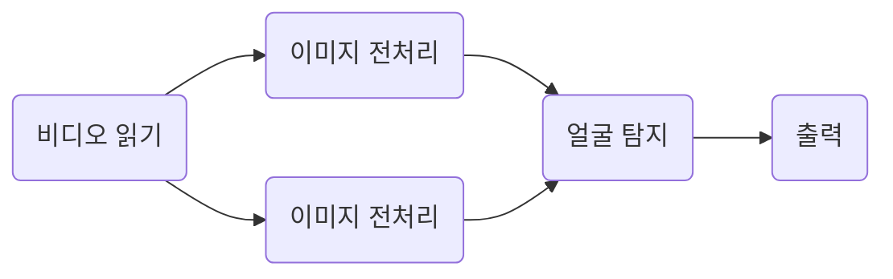
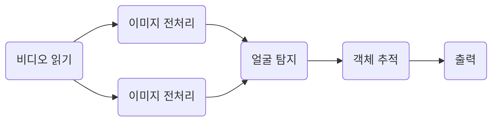

# 얼굴 탐지 프로그램
 실시간 얼굴 인식 및 분류를 위해서는 영상에서 얼굴을 찾아야 한다. 해당 프로그램은 얼굴을 영상에서 찾기 위해 제작하게 됐다. 프로그램의 주요 목표는 아래와 같다.

 * 정확한 얼굴 탐지
 * 얼굴의 기울어짐 인식
 * 얼굴 인식을 위한 이미지 전처리

목표를 달성하기 위해 알고리즘을 먼저 선정했다.

----

## 알고리즘
### 얼굴 탐지
얼굴 탐지 알고리즘은 종류에 따라 장단점이 있다. 당연히 정확하게 인식할수록 계산비용이 높고, 빠르게 인식할수록 정확하지 못하다. 적절한 알고리즘을 선택해야하고, 경우에따라 혼합할 수 있어야 한다

 * Haar Cascade: 머신러닝 기반 알고리즘이다. 사람 얼굴에 대한 [**Haar 특징**](#haar_feature)을 학습한다.
 * MTCNN: 딥러닝 기반 알고리즘이다. 얼굴 및 얼굴의 주요 특징인 눈, 코, 입을 찾는다. P-Net, R-Net, O-Net 3단계를 통해서 얼굴을 탐지한다
 * dlib: 머신러닝 기반 라이브러리로써, HOG 또는 CNN을 활용하여 얼굴 검출, 인식, 특징 추츨 등을 할 수 있다. 

### 얼굴 추적 (광학 흐름)
 오직 얼굴 탐지 알고리즘만을 이용하여 얼굴을 추적하면 분명히 계산비용이 높을 것으로 예상된다. 특정 주기에 얼굴 탐지를 하고, 사이에 얼굴 탐지는 광학 흐름을 이용하는게 좋다고 생각한다.

* Gunner Farneback: 다항식 확장을 사용하여 이웃 픽셀 간의 상관 관계를 계산. 전체 영상을 고려하는 방법 상대적으로 정확하지만 계산 비용이 높다
* Lucas Kanade: 소규모 움직임을 가정하고, 그 움직임이 이웃 픽셀에도 동일하게 적용된다고 가정. 특정 픽셀 주변의 작은 창을 고려하는 방법으로, 계산 비용이 낮지만 큰 움직임에 대해서는 정확도 낮음

### 이미지 전처리
 얼굴 탐지 전 더 나은 결과를 보장받기 위해서는 이미지 전처리는 필수이다. 이미지의 노이즈 제거, 정규화, 스케일 조정 등이 이에 포함된다.

 * Wiener Deconvolution: 다양한 블러 유형과 노이즈 수준에 적응할 수 있는 강력한 기법
 * Richardson-Lucy Deconvolution: 이 알고리즘은 포아송 노이즈를 가정하며, 다양한 블러 유형에 대해 잘 동작한다
 * Total Variation Deblurring: 이 방법은 노이즈를 효과적으로 제거하면서 세부 사항을 유지하므로, 다양한 유형의 이미지에 적용할 수 있음
 * Blind Deconvolution: 이 방법은 블러 커널이 알려져 있지 않은 상황에 대해 유용하다. 블러의 원인이 불분명한 경우에도 사용할 수 있다.

 ----

## 아이디어

1. 얼굴 탐지를 매번 하지 말고, n프레임당 한번씩 진행하며 이를 힌트로 사용하자
2. 첫 프레임은 계산 비용이 비교적 낮은 Haar Cascade 알고리즘을 기반으로 얼굴을 찾고, 광학 흐름 알고리즘을 사용하여 객체를 연속적으로 추적하자 
3. n 프레임당 한번씩 얼굴 탐지를 진행하며 이를 바탕으로 광학 흐름으로 추적한 객체의 오차를 조정하자
4. 얼굴의 각도(또는 눈, 코, 입 위치)를 알 수 있는 알고리즘을 사용하여 얼굴의 방향을 수평으로 맞추자
5. 이미지 전처리와 스케일 조정으로 계산비용을 아끼면서 정확도를 높이자

----
## 첫번째 목표: 영상 저지연 얼굴 탐지

 먼저 영상에서 지연 없이 얼굴을 탐지하고, 이를 바탕으로 실시간 얼굴 탐지를 해볼 생각이다.
기본적인 설계는 아래와 같다.

복잡한 구조 없이 선형적으로 코드가 진행된다. Haar Cascade 알고리즘을 사용했을때는 작동에 큰 문제가 없다. 하지만 딥러닝 기반 알고리즘인 MtCNN을 사용했을때는 지연이 심했다. 아래는 각 알고리즘의 연산 속도 비교이다. 얼굴 탐지 알고리즘을 제외하고는 구조는 동일하다.

연산속도가 약 20배 정도로 많이 차이 난다. Haar Cascade 알고리즘의 연산속도는 평균적인 프레임 간격인 0.04초보다 빠르다. 실시간 처리에 사용하기 적합하다고 볼 수 있다. 하지만 MtCNN은 0.46초로 10배이상 느린 것을 볼 수 있다. 이는 실시간 처리에 매우 부적합하다는 것을 알 수 있다. 
영상 재생 속도에 영향을 주지 않고, 얼굴을 탐지 할 방법을 찾아야한다. Haar Cascade는 문제없지만 MtCNN이 문제가 된다. 

새로운 구조이다. 사실 위의 구조랑 큰 차이가 없다. 하지만 각 로직이 다른 프로세서에서 동작한다는 차이점이 있다. 하지만 GPU 하나를 사용하는 딥러닝 연산에서는 큰 차이가 없다. 다른 방법이 필요하다. 딥러닝 기반 얼굴 탐지 속도를 높일 해결책은 모델을 변경하거나, 모델의 하이퍼파라미터 조작과 배치파일의 크기를 키우는 방법 밖에 없다. 배치파일 크기를 키우는 것 조차 전송속도에 시간이 걸리기에 적절한 지점을 찾아야한다. 하지만 단일 프로세서와 다르게 병렬로 데이터를 처리하기 때문에 이미지를 읽거나, 재생할 때 동시에 딥러닝을 진행 할 수 있게 됐다. 
(현재 기능을 각각 또는 여러개를 하나의 프로세서에 할당하게 했다. 이미지 전처리는 현재로써 사용하지 않지만, 몇몇 알고리즘은 계산비용이 높기때문에 유동적으로 프로세서를 분리할 수 있게 코딩했다. 프로세서를 나누는데 급급한 나머지 낭비되는 프로세서가 발생하기도하며, 전달하는데 사용하는 압축과 직렬화의 오버헤드가 큰 경우가 있다.)

데이터 처리 결과이다. 전체적인 프레임당 처리 속도는 이전 단일 프로세서로 동작한 프로그램보다는 훨씬 빠르다.(Haar Cascade또한 차이가 있지만, 여기에는 작은 오류가 있다. 단일 프로세서로 실행한 테스트는 Haar Cascade 알고리즘의 동작시간만을 측정한 것은 아니다. 이번에 멀티 프로세서로 실행한 테스트에서는 Haar Cascade 알고리즘의 동작시간만을 측정한 것이다. 그래서 조금 빠르다. 거기다 Haar Cascade 알고리즘을 처리하는 프로세서를 한개로 설정해 두었기 때문에 큰 차이가 없는 속도가 나왔지만 프로세서를 늘리면 그만큼 빠른게 처리 될 것이라고 기대된다.) 배치처리한 결과로 MtCNN에서 1 프레임당 처리속도가 무려 약 11배 가량 빨라졌다. 0.041 초면 약간의 딜레이는 있겠지만 영상을 큰 지연없이 재생할 수 있는 속도이다. 하지만 이는 실시간 얼굴 탐지에는 큰 도움이 되지 못한다.

그래도 일단은 영상 재생에 있어서는 지연 없이 재생 할 수 있게 해야하지 않겠나? 이제 모든 프레임에 얼굴 탐지를 진행하는 것은 힘들다는 것을 알게 됐다. 당연하다. 현재 테스트 하는 컴퓨터는 나름 고성능 컴퓨터이다. 하지만 얼굴 탐지를 진행하는 기기는 모두 고성능이지 않다. 단 하나의 프레임을 계산하는 것도 꽤 오래 걸릴 수 있다. 이제 이를 극복해야 한다. 광학 흐름이라는 알고리즘이 있다. 이미지에서 객체가 움직이는 방향을 찾는 것이다. 즉 처음 얼굴을 찾으면 어느정도 따라갈 수 있다는 것이다. 이를 이용하여 알고리즘을 만들어 보자.

일단 계산비용이 낮은 LucasKanade 알고리즘을 사용하여 객체를 추적했다. (물론 현재는 멀티프로세싱 구조를 가졌기에 Gunner Farneback 알고리즘을 사용해도 괜찮다고 본다. 정확도도 더 높기 때문에 추후에 적용해보자.) 간단하게 얼굴을 인식한 후 얼굴 박스 안의 특징점들의 이동 값 평균으로 이동경로를 만들었다. 물론 평균값으로 이동하기때문에 정확하지 않지만 10프레임 간격으로 추적했고, 이는 아주 짧은 시간이라 1프레임당 얼굴을 탐색한 것과 크게 다르지 않았다. 하지만 연산 속도에는 엄청난 이득이 있었다.

{: .left } 
{: .right }

먼저 단일 프로세서의 결과이다. MtCNN는 약 80배 Haar 은 약 43배 빨라진 것을 알 수 있다. 계산 비용이 높은 MtCNN이 이전보다 훨씬 빨라 진 것을 알 수 있다. 다음은 멀티 프로세서에서의 연산 속도 변화이다. MtCNN은 대략 4배 빨라졌고, Haar은 10배 정도 빨라졌다.  이제 영상에서 지연 없이 얼굴을 탐색할 수 있게 됐다. 물론 정확도는 아직 많이 떨어진다. 이제는 정확도를 향상시킬 차례이다. 

----

## 생각해 보아야 할 것
사실 영상에서 지연 없이 얼굴을 탐지하는 것과, 실시간으로 얼굴을 탐지하는 것은 차이가 꽤 크다. 영상은 이미지를 미리 불러올 수 있다는 것이다. 이 차이로 이미지를 한번에 처리할 수 있게 되고 이는 연산 시간 단축이라는 결과로 연결된다. 하지만 실시간 처리 전, 영상에서 얼굴을 탐지하는 것은 실시간 영상 탐지를 만드는데 많은 힌트를 줄 것이라고 믿는다. 이제 더 최적화 된 코드를 작성하고, 정확도를 높여야 한다.

* 프로세서 간 정보전달을 할때, 현재는 이미지 압축 후 직렬화 하여 전송한다. 이는 메모리에 있는 데이터가 복사됨을 의미한다. 그냥 메모리의 주소를 전달 할 방법이 있을까? (Queue 사용에서 공유메모리 사용을 고려해보자)
* 현재 모델의 정확도가 높지 않다. 어두운 곳의 얼굴을 인식 못하기도 하며, 흐릿한 얼굴도 인식을 잘 하지 못한다. 이는 이미지 전처리 알고리즘을 추후에 적용시켜서 개선해 볼 점이다.
* 구조적 문제가 있다. 기능별로 프로세서를 나눌 수 있게 했지만, 효율적이진 않다고 본다. 앞서 언급한 데이터 전송의 오버헤드가 너무나도 크다. 모든 연산속도의 10%를 차지한다.
* HOG 알고리즘이 생각보다 흥미롭다. 히스토그램을 이용하여 이미지의 유사도 또한 판단 할 수 있을 거 같다. 
* 실시간 얼굴 탐지 알고리즘은 현재로써는 정확하지 않지만 빠른 탐지가 가능한 알고리즘을 이용하여 얼굴을 탐지하고, 이를 광학 흐름 알고리즘을 사용하여 실시간으로 추적하며, 추후 나오는 딥러닝 데이터를 바탕으로 오차를 조정하는 방법이 최선일 거 같다.
* 광학 흐름을 블러 커널로 사용하는 방법. 광학 흐름으로 객체의 이동 방향을 알 수 있다면, 이는 이미지에서 블러를 제거할때 사용되는 블러 커널로 사용 될 수 있다.

지금 생각해보면 단순히 쓰레드만 사용해도 많은 문제가 해결 되었다. 생각이 조금 짧았다.

-----

## 단어

- Haar Feature : 픽셀간의 밝기 차이를 측정하여 나타낸 특징. 흑백 사각형 패턴으로 이루어짐 

- HOG : Histogram of Oriented Gradients. 이미지의 히스토그램을 분석하여 경계를 파악하는 알고리즘 
 